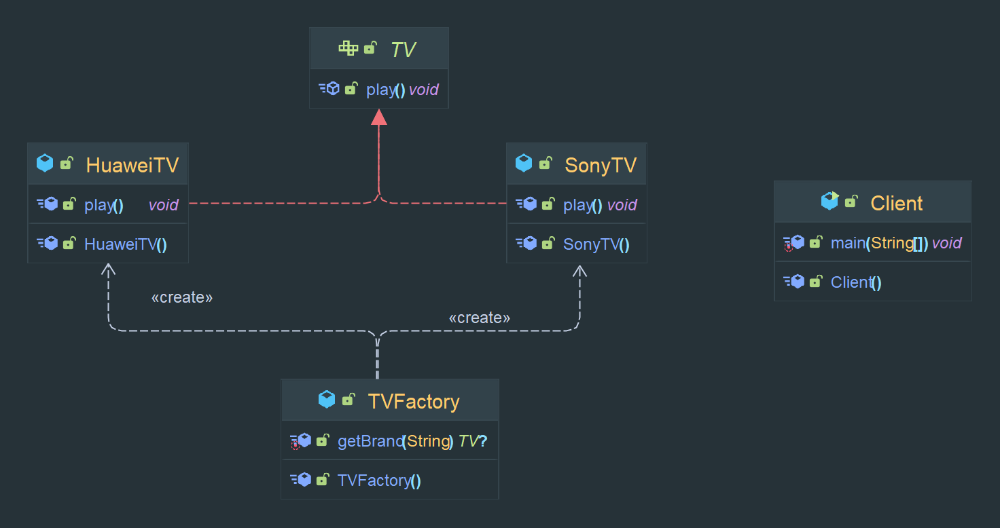
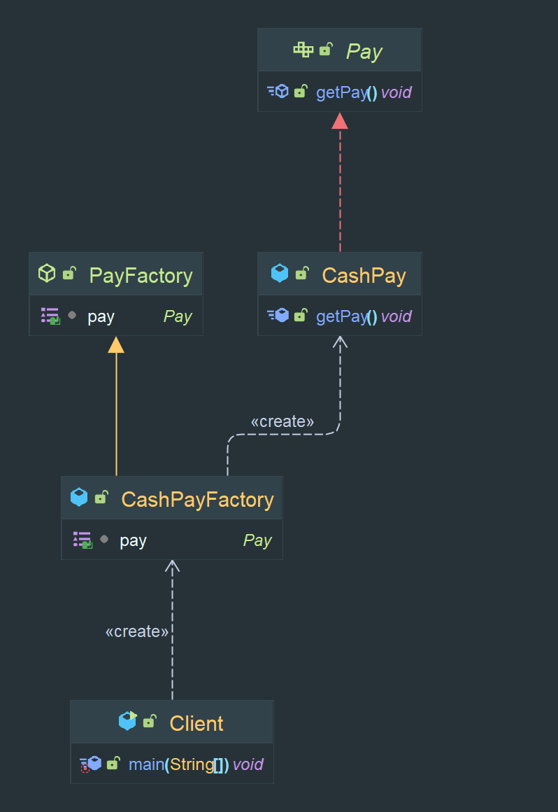
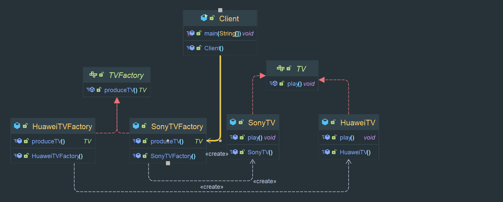
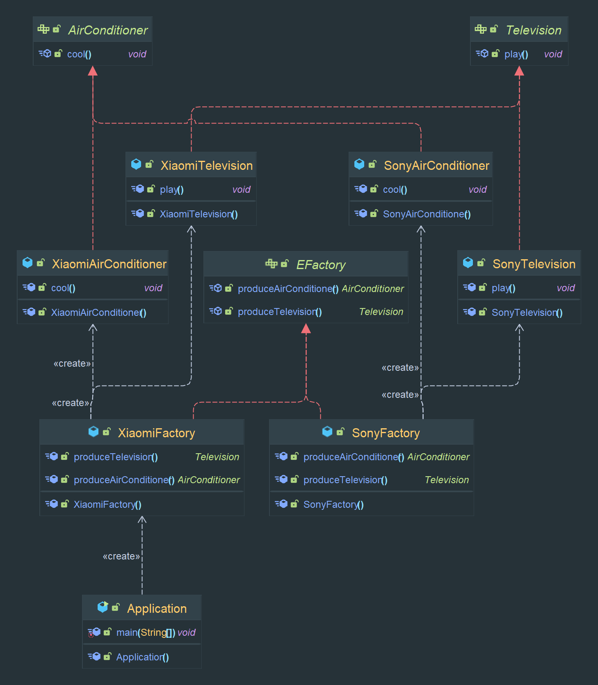
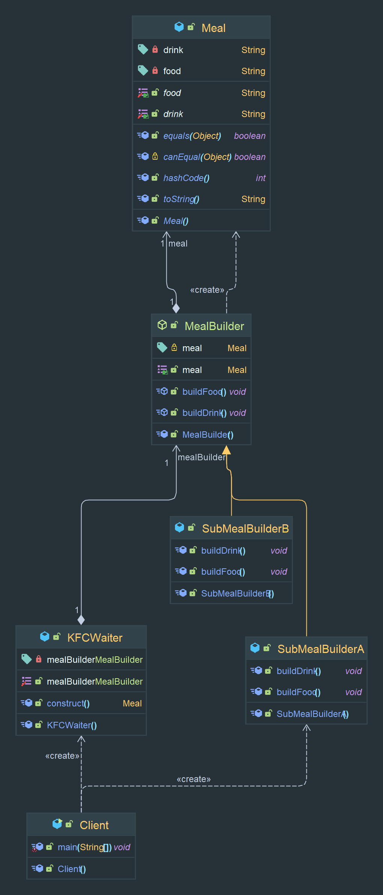
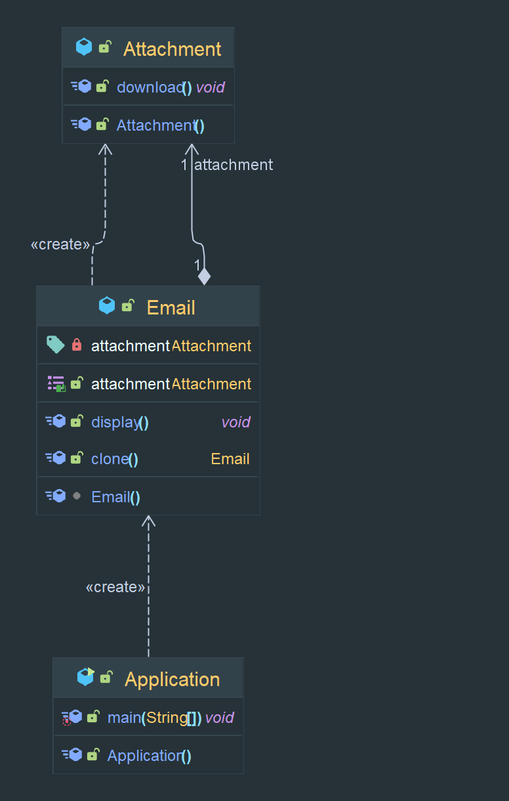
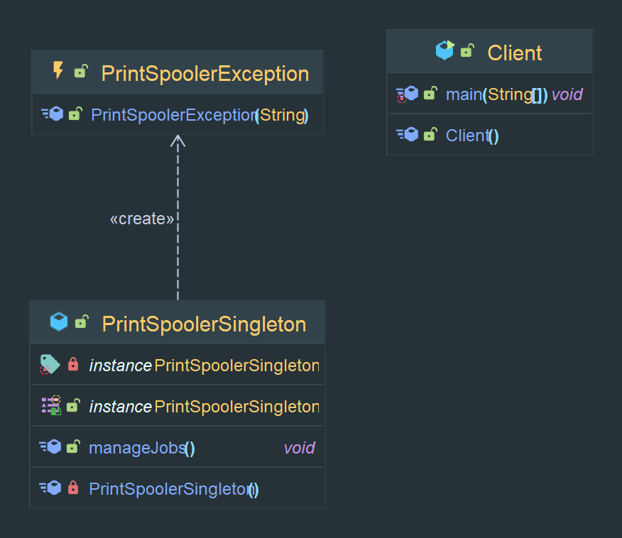

# Java设计模式

远程仓库地址：https://github.com/2yyue/java_design_pattern.git

## 一、面向对象设计原则

1. 单一职责原则
   Single Responsibility Principle(SRP) 类的职责要单一，不能将太多的职责放在一个类中。
2. 开闭原则
   Open-Closed Principle(OCP) 软件实体**对扩展开放，对修改关闭**。即在不修改程序的基础上扩展其功能。
3. 里氏代换原则
   Liskov Substitution Principle(LSP) 程序中，可以接受基类对象的代码块一定可以接受子类对象。
4. 依赖倒转原则
   Dependency Inversion Principle(DIP) 针对抽象层编程，而不要针对实现类编程。
5. 接口隔离原则
   Interface Segregation Principle(ISP)使用多个专门的接口来取代一个统一的接口。
6. 合成复用原则
   Composite Reuse Principle(CRP) 尽可能使用组合和聚合关联关系，尽量少甚至不适用继承关系。
7. 迪米特法则(又叫最少知道原则)
   Law of Demeter(LoD) 一个软件实体对其他实体的引用越少越好。即若两个类不必直接通信，那么这两个类就不应当发生直接的相互作用，而是通过引入第三者发生间接交互。

## 二、设计模式的分类

1. 根据目的分为创建型、结构型和行为型三种
2. 根据设计模式应用范围分为类模式和对象模式

|  范围\目的   |               创建型模式                |                              结构型模式                              |                                       行为型模式                                       |
|:--------:|:----------------------------------:|:---------------------------------------------------------------:|:---------------------------------------------------------------------------------:|
| **类模式**  |               工厂方法模式               |                            (类)适配器模式                             |                                 解释器模式 模板方法模式                                  |
| **对象模式** | 抽象工厂模式 建造者模式 原型模式 单例模式 | (对象)适配器模式 桥接模式 组合模式 装饰模式 外观模式 享元模式 代理模式 | 职责链模式 命令模式 迭代模式 中介者模式 备忘录模式 观察者模式 状态模式 策略模式 访问者模式 |

<table>
<tr>
<th>模式类型</th>
<th>模式名称</th>
<th>模式说明</th>
</tr>
<tr>
<td rowspan="6">创建型模式  Creational Patterns</td>
 <tr>
    <td>抽象工厂模式 Abstract Factory</td>
    <td>提供了一个创建一系列相关或互相依赖对象的接口，而无须指定具体实现</td>
  </tr>
<tr>
    <td>建造者模式 Builder</td>
    <td>将一个复杂对象的构建和表示分离，使得同样构建过程可以创建不同的表示</td>
  </tr>
  <tr>
    <td>工厂方法模式 Factory Method</td>
    <td>将类的实例化操作延迟到子类中进行，即由子类决定实例化哪种类</td>
  </tr>
  <tr>
    <td>原型模式 Prototype</td>
    <td>通过给定原型对象来指明所要创建的对象的类型，然后通过复制这个原型对象的办法创建出更多同类型的对象</td>
  </tr>
  <tr>
    <td>单例模式 Singleton</td>
    <td>确保在系统中某一个类只有一个实例，而且自行实例化向整个系统提供这个实例</td>
  </tr>
<tr>
<td rowspan="8">结构型模式  Structural Patterns</td>
 <tr>
    <td>适配器模式 Adapter</td>
    <td>将一个接口转换成用户期待的另一个接口，从而使接口不兼容的那些类可以一起工作</td>
  </tr>
<tr>
    <td>桥接模式 Bridge</td>
    <td>将抽象部分与他的实现分离，使二者可以独立变化</td>
  </tr>
  <tr>
    <td>组合模式 Composite</td>
    <td>通过组合多个对象形成树形结构以表示“整体-部分”的结构层次，对单个对象(即叶子对象)和组合对象(即容器对象)的使用具有一致性</td>
  </tr>
  <tr>
    <td>装饰模式 Decorator</td>
    <td>动态地为一个对象增加额外的职责</td>
  </tr>
  <tr>
    <td>外观模式 Facade</td>
    <td>为复杂子系统提供一个一样的接口</td>
  </tr>
<tr><td>享元模式 Flyweight</td>
<td>通过运用共享技术有效地支持大量细粒度对象的复用</td></tr>
<tr><td>代理模式 Proxy</td>
<td>给某一对象提供一个代理，并由代理对象控制对原对象的引用</td></tr>
<tr>
<td rowspan="12">行为型模式  Behavioral Patterns</td>
 <tr>
    <td>职责链模式 Chain of Responsibility</td>
    <td>避免请求发送者与接收者耦合在一起，让多个对象都有可能接收请求，将这些对象连接成一条链，并且沿着这条链传递请求，直至有对象处理它为止</td>
  </tr>
<tr>
    <td>命令模式 Command</td>
    <td>将一个请求封装为一个对象，从而使得请求调用者和请求接收者解耦</td>
  </tr>
  <tr>
    <td>解释器模式 Interpreter</td>
    <td>描述如何为语言定义一个文法，如何在该语言中表示一个句子，以及如何解释这些句子</td>
  </tr>
  <tr>
    <td>迭代器模式 Iterator</td>
    <td>提供一个方法来访问聚合对象，而不暴露这个对象的内部表示</td>
  </tr>
  <tr>
    <td>中介者模式 Mediator</td>
    <td>通过一个中介对象来封装一系列的对象交互，使得各对象无需显式相互引用，从而使耦合松散，而且可以独立地改变他们之间的交互</td>
  </tr>
<tr>
    <td>备忘录模式 Memento</td>
    <td>在不破坏封装的前提下，捕获一个对象的内部状态，并在该对象外保存这个状态，这样可以在以后回档该备份</td>
  </tr>
<tr>
    <td>观察者模式 Observer</td>
    <td>定义了对象间的一种一对多依赖关系，使得当一个对象状态发生改变时，其相关依赖对象都能得到通知并自动更新</td>
  </tr>
<tr>
    <td>状态模式 State</td>
    <td>允许一个对象在其内部状态改变时改变它的行为</td>
  </tr>
<tr>
    <td>策略模式 Strategy</td>
    <td>定义一系列算法，并将每一个算法封装在一个类中，并让他们可以相互替换，策略模式让算法独立与使用它的用户而变化</td>
  </tr>
<tr>
    <td>模板方法模式 Template Method</td>
    <td>定义一个操作中算法的骨架，而将一些步骤延迟到子类中</td>
  </tr>
<tr>
    <td>访问者模式 Visitor</td>
    <td>表示一个作用于某对象结构中的各元素的操作，它使得用户可以在不改变各元素的类的前提下定义作用于这些元素的新操作</td>
  </tr>
</table>

## 三、设计模式

> 1. 创建型模式:关注对象的创建过程，将创建与使用分离，使用时无需了解对象的创建细节，可以多次复用，对类的实例化过程进行抽象。

1. 简单工厂模式
   简单工厂模式Simple Factory Pattern又称为静态工厂方法模式Static Factory Method Pattern，属于类创建型模式。

抽象TV接口有播放play()方法，两个品牌的TV类实现了这个抽象接口，TVFactory抽象工厂类通过获取不同的品牌名生产不同的具体产品类。为依赖关系

+ 空心三角+虚线=接口实现关系，由具体实现指向接口；
+ 箭头+虚线=依赖关系，由使用方指向被调用方。

使用场景：
- 1.工厂类负责创建的对象较少；
- 2.客户端只负责传入工厂类的参数，不关心如何创建对象。

2. 工厂方法模式
   工厂方法模式Factory Method Pattern又称为工厂模式，也叫虚拟构造器Virtual Constructor模式或者多态工厂Polymorphic Factory模式，属于类创建型模式。在工厂方法模式中，工厂父类负责定义创建产品对象的公共接口，而工厂子类负责生产具体的产品对象，目的是将产品类的实例化操作延迟到工厂子类中完成，即通过工厂子类来确定实例化具体的产品对象。

使用场景：
- 1.一个类不知道所需要的对象的类
- 2.一个类通过其子类指定创建哪种对象
- 3.将创建对象任务委托给多个子工厂类，客户端在使用时无需关注哪个工厂生产产品子类对象，需要时再动态指定
3. 抽象工厂模式
   抽象工厂模式Abstract Factory Pattern又称为构建器模式，kit模式，属于类创建型模式。提供一系列相关或相互依赖对象的接口，而无需指定它们特定的类。

使用场景：
- 1.一个系统无须关心对象的创建过程，将对象的创建与使用解耦。
- 2.有多个产品族，但每次只需要使用其中某一产品族。且同一产品族的产品会一起使用。
- 3.提供一个产品类的库，所有产品以同样的接口出现，客户端不依赖具体实现。

4. 建造者模式
   建造者模式Builder是最复杂的创建型模式，它用于创建一个包含多个组成部分的复杂对象，可以返回一个完整的产品对象给用户。将一个复杂对象的构建与它的表示分离，使得同样的构建过程可以创建不同的表示。
使用场景：
- 1.需要生成的产品对象具有复杂的内部结构，通常包含多个成员属性。
- 2.需要生成的产品对象的属性相互依赖，需要指定其生成顺序。
- 3.对象的创建过程独立于创建该对象的类。
- 4.隔离复杂对象的创建和使用，并使得相同的创建过程可以创建不同的产品。

5. 原型模式
   原型模式Prototype使用原型模式可以复制多个相同或相近的对象。是一种对象创建型模式，用原型实例指定创建对象的种类，并且通过复制这些原型来创建新的对象。允许对象再次创建更多可定制对象而无需知道任何创建细节。
可以进行深克隆和浅克隆。浅克隆是指只复制这个对象，而不复制引用对象。深克隆是都复制。完全复制。

使用场景：
- 1.创建新对象成本较大，初始化占用较长时间，占用较多资源或网络资源。
- 2.系统需要保存对象的状态，对象的状态变化很小，或者对象本身占用内存不大的时候可以使用原型模式或备忘录模式。
- 3.需要避免使用分层次的工厂类来创建分层次的对象，并且类的实例对象只有一个或很少的几个组合状态。

6. 单例模式
单例模式Singleton，确保系统中某一个类只能有一个实例，并且自行实例化向整个系统提供这个实例，这个类叫做单例类。要点有三：1.某个类只有一个实例；2.必须自行创建这个实例；3.必须自行向整个系统提供这个实例。
单例模式是一种对象创建型模式，又称单件模式或单态模式。
使用场景：
- 1.系统只需要一个实例对象，或者需要消耗大量资源才能创建一个对象。
- 2.客户调用类的单个实例只允许使用一个公共访问点，除了这个公共访问点不能通过其他途径访问该实例。
- 3.一个系统中要求一个类只有一个实例。

7. 适配器模式
8. 桥接模式
9. 组合模式
10. 装饰模式
11. 外观模式
12. 享元模式
13. 代理模式
14. 职责链模式
15. 命令模式
16. 解释器模式
17. 迭代器模式
18. 中介者模式
19. 备忘录模式
20. 观察者模式
21. 状态模式
22. 策略模式
23. 模板方法模式
24. 访问者模式
